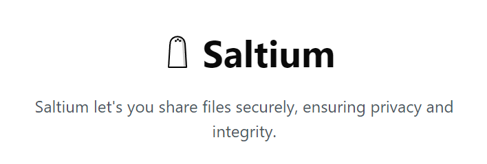

  

Saltium is a secure file-sharing app that encrypts and protects your files with JWT-based access control. Easily upload, encrypt, and share files via download links. Features include token expiration and link invalidation.

### To Add:
- S3 support (only for signed in users)
- P2P file share (no size-limits)
- - Chunking and Resuming: Implement file chunking with the ability to resume downloads from the last successful chunk.
- - Error Checking: Use checksums or hashes to verify file integrity after transfer.
- - Fallback Options: Consider implementing a fallback to a centralized server if P2P fails.
- UDP to reduce latency in P2P (maybe)
